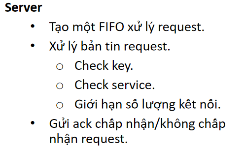

# Pipes/FIFOs in linux

## I. Giới thiệu
### 1. Định nghĩa
- Pipes là một trong số các phương thức IPC được sử dụng trong việc truyền thông liên tiến trình.
- Pipes chỉ là giao tiếp một chiều, tức là chúng ta chỉ có thể sử dụng pipe sao cho một quá trình thực hiện ghi vào pipe và quá trình kia đọc từ pipe.
## 2 Hoạt động
- Khi tạo một pipe, nó sẽ nằm trong RAM và được coi là một "virtual file".
- Pipes có thể  sử dụng trong quá trình tạo process.
- Khi một process ghi vào "virtual file" (hoặc có thể hiểu là pipe) thì một tiến trình liên quan (related-process) khác có thể đọc dữ liệu từ nó.
- Reading from a pipe:
\- Nếu cố gắng đọc dữ liệu từ một pipe "rỗng", thì đầu read sẽ block cho đến khi đọc được ít nhất 1 bytes.
\- Nếu đầu write của một đường ống bị đóng, đầu read đọc lại toàn bộ dữ liệu còn lại trong pipe và return 0.
- Pipes have a limited capacity:
\- Một pipe chỉ đơn giản là một bộ đệm được duy trì trong bộ nhớ.
\- Bộ đệm này có dung lượng tối đa. Khi một pipe đã đầy, chỉ khi khi đầu read lấy một số dữ liệu khỏi pipe thì đầu write mới có thể ghi tiếp dữ liệu vào pipe.
## II. Tạo và sử dụng Pipes
### 1. Tạo Pipes
- system call pipe().
- Nếu ta tạo pipe trước khi gọi fork(). Thì parent and child (related-process) có thể giao tiếp thông qua pipe.
``` C
int pipe(int fds[2]);
```
### 2. Giao tiếp hai chiều
- Chỉ cần tạo hai pipes để gửi dữ liệu theo từng hướng giữa hai quá trình. 
- Nếu sử dụng kỹ thuật này, thì chúng ta cần cảnh giác với các trường hợp bế tắc có thể xảy ra nếu cả hai quy trình bị block trong khi cố gắng đọc từ các pipe rỗng hoặc trong khi cố gắng ghi vào các pipe đã đầy.
- Parent đóng vai trò writer.
- Child đóng vai trò reader.

## III. FIFOs/Named Pipes
### 1 Định nghĩa
Đây là một khái niệm mở rộng của pipes. Pipes truyền thống thì không được đặt tên và chỉ tồn tại trong suốt vòng đời của process.
Sự khác biệt chính là FIFOs có tên trong hệ thống tệp và được mở giống như một tệp thông thường.
Named Pipes có thể tồn tại miễn là hệ thống còn hoạt động. Vượt ra ngoài vòng đời của process. Có thể xóa đi nếu không còn sử dụng.
Một file FIFO là một file đặc biệt được lưu trong bộ nhớ cục bộ. được tạo ra bởi hàm mkfifo() trong C. 
### 2 Tạo FIFOs từ trình shell
 Lệnh: mkfifo [ -m mode ] pathname
I.E: mkfifo -m 0666 ./helloFIFO
### 3 Tạo FIFOs từ source code
mkfifo()
FIFOs là một loại tệp, chúng ta có thể sử dụng tất cả các lệnh gọi hệ thống được liên kết với nó i.e. open, read, write, close.

## IV. Xây dựng mô hình Client-Server với FIFOs
### Bài toán: Xây dựng một mô hình client server sử dụng FIFOs.
#### B1: Thiết lập kết nối
- Làm sao để clients biết tới server?
- well-know address/name.
    * Vị trí cố định.
- Server được định danh.
    * Cung cấp nhiều services.
    * Client phải request tới để đăng kí.
    * Thêm chi phí (tiền, lập trình).
#### B2: Xử lý yêu cầu kết nối


#### B3: Xử lý bản tin
- Nhớ lại rằng dữ liệu trong đường ống và FIFO là một luồng byte, ranh giới giữa nhiều bản tin không được bảo toàn.
- Điều này có nghĩa là khi nhiều bản tin gửi đến một quá trình, chẳng hạn như server, thì người gửi và người nhận phải đồng ý về một số quy ước để tách các thư. 
\- Kết thúc mỗi thư bằng ký tự phân cách.
    * Ký tự không bao giờ xuất hiện như một phần của bản tin.
    * Quá trình đọc thông báo phải quét dữ liệu từ FIFO từng byte một cho đến khi tìm thấy ký tự phân tách.
    * Bao gồm header có kích thước cố định với trường độ dài trong mỗi bản tin.
        + Hiệu quả  đối với các bản tin có kích thước tùy ý.
        + Dẫn đến sự cố nếu bản tin không đúng định dạng.
    * Sử dụng các bản tin có độ dài cố định và yêu cầu server luôn đọc các bản tin có kích thước cố định này.
        + Điều này có lợi thế là đơn giản để lập trình.
        + Dung lượng kênh truyền bị lãng phí.
        + Nếu một tin nhắn không có độ dài phù hợp, thì tất cả các tin nhắn tiếp theo sẽ bị lệch. Trong trường hợp này, server không thể khôi phục dễ dàng.


